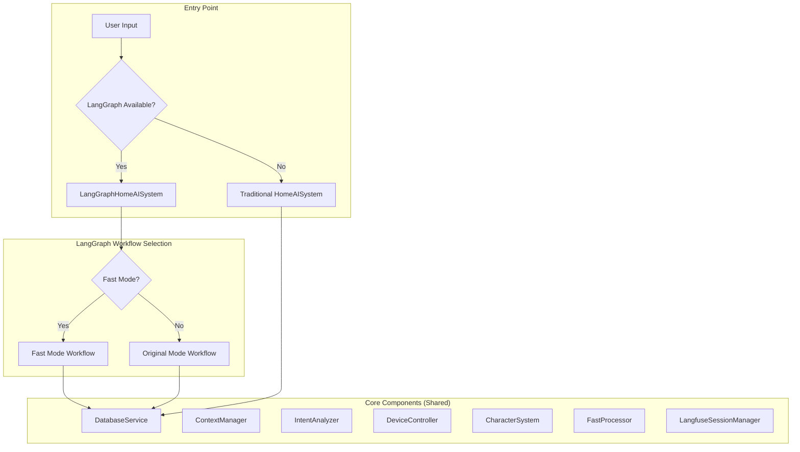
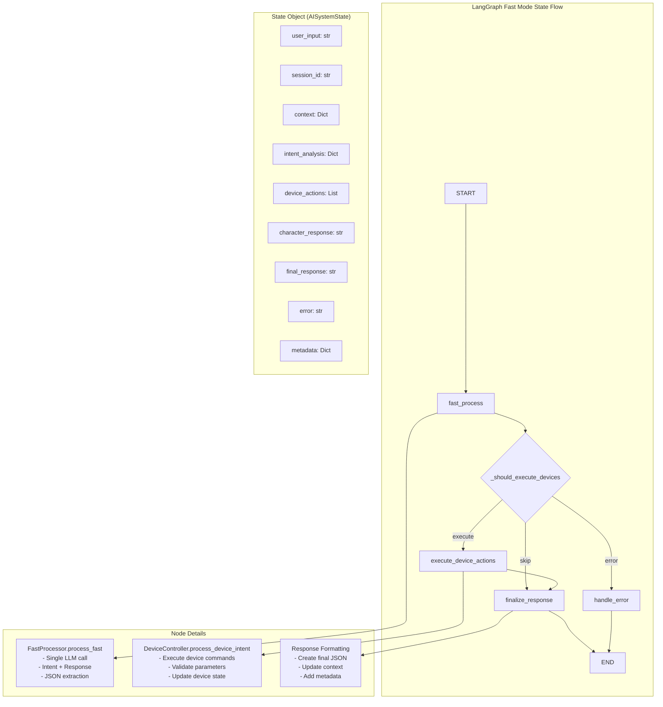
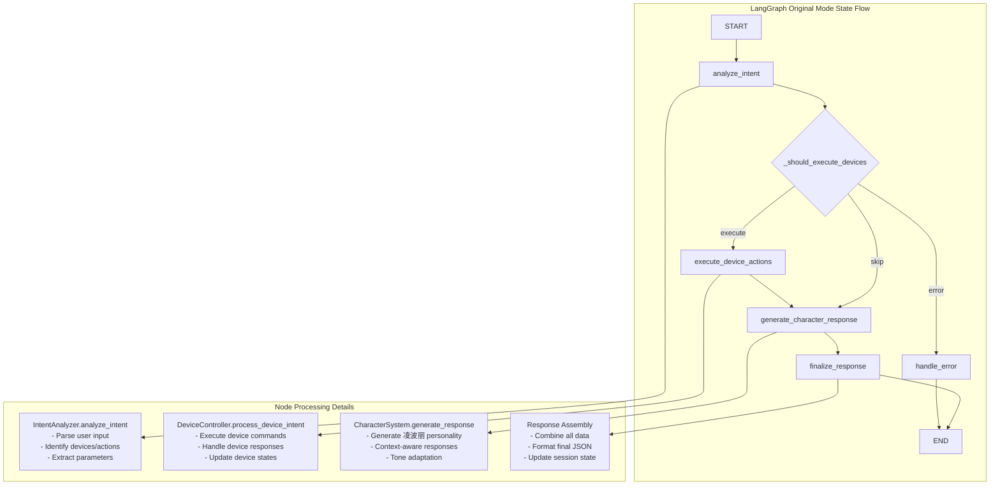
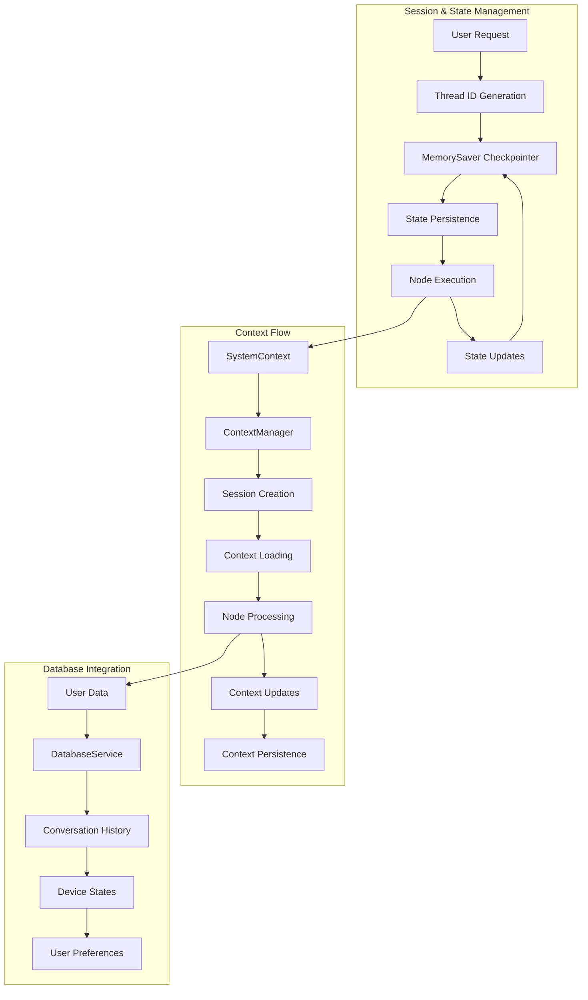
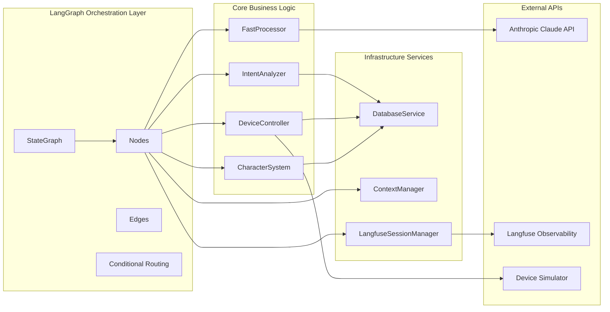
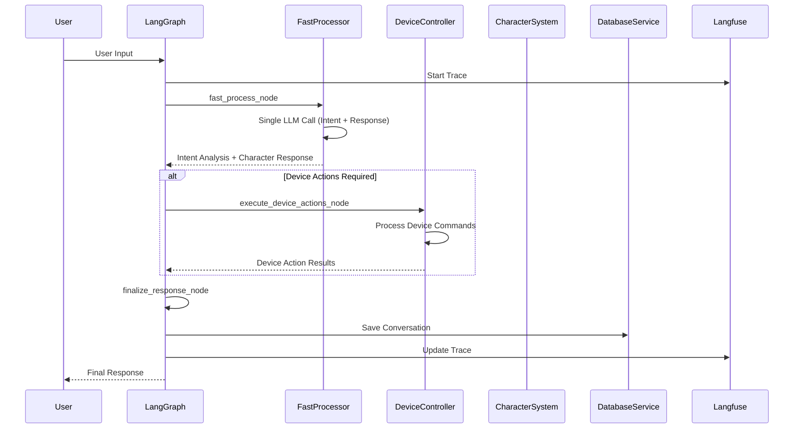
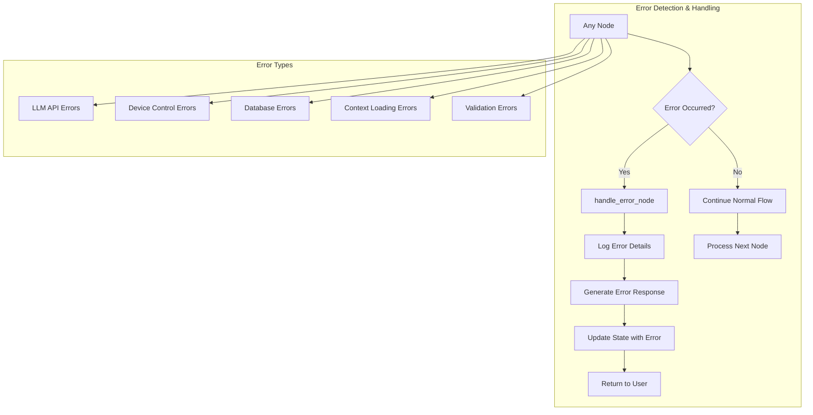
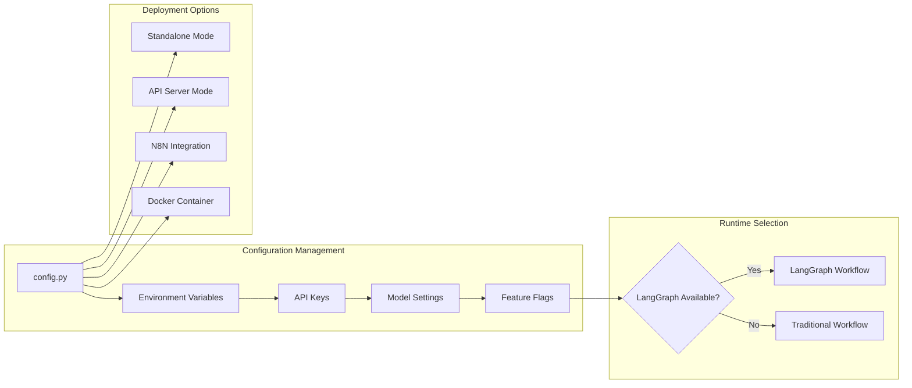
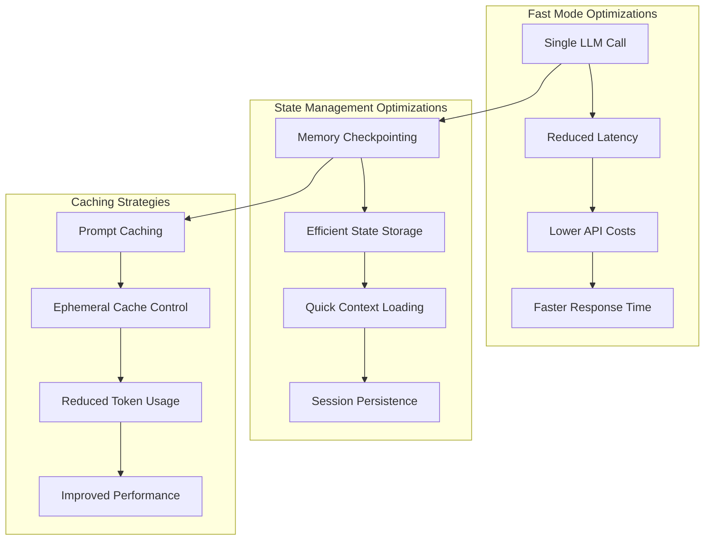

# LangGraph Workflow Structure Diagram

## System Architecture Overview



## Fast Mode Workflow (Default)



## Original Mode Workflow



## State Management Architecture



## Component Integration Diagram



## Data Flow Architecture



## Error Handling Flow



## Observability & Monitoring

```mermaid
graph TB
    subgraph "Langfuse Integration"
        A[Node Execution] --> B[@observe Decorators]
        B --> C[Automatic Tracing]
        C --> D[Performance Metrics]
        D --> E[Error Tracking]
        E --> F[User Analytics]
    end
    
    subgraph "Trace Hierarchy"
        G[Session Trace]
        G --> H[Workflow Trace]
        H --> I[Node Spans]
        I --> J[Component Spans]
        J --> K[API Call Spans]
    end
    
    subgraph "Metrics Collected"
        L[Response Time]
        M[Success Rate]
        N[Error Frequency]
        O[User Satisfaction]
        P[Device Action Success]
    end
    
    C --> G
    D --> L
    E --> N
    F --> O
```

## Configuration & Deployment



## Performance Optimization



## Legend

- **Rectangles**: Processing nodes/components
- **Diamonds**: Decision points/conditional logic
- **Rounded Rectangles**: Start/End points
- **Dashed Lines**: Optional/conditional flows
- **Solid Lines**: Required flows
- **Subgraphs**: Logical groupings of related components

This diagram shows the complete LangGraph workflow architecture, including state management, component integration, error handling, and observability features.
